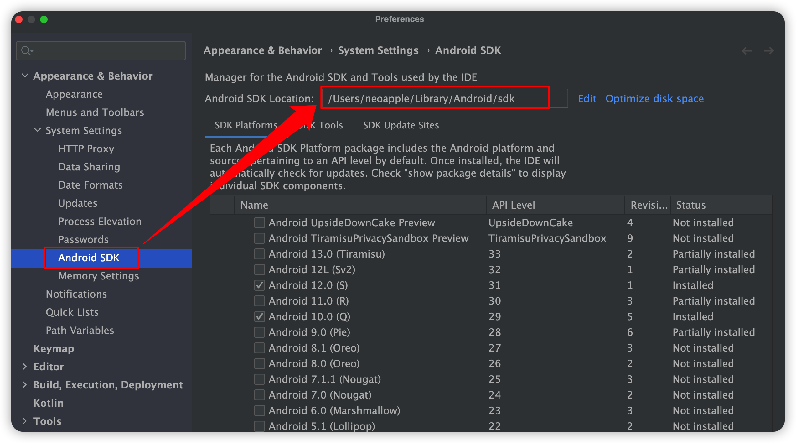
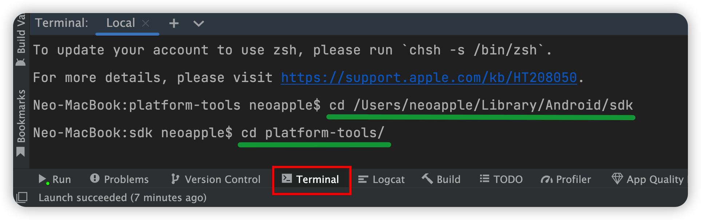
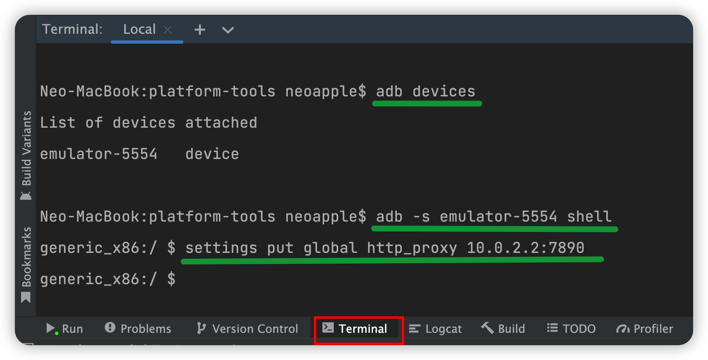
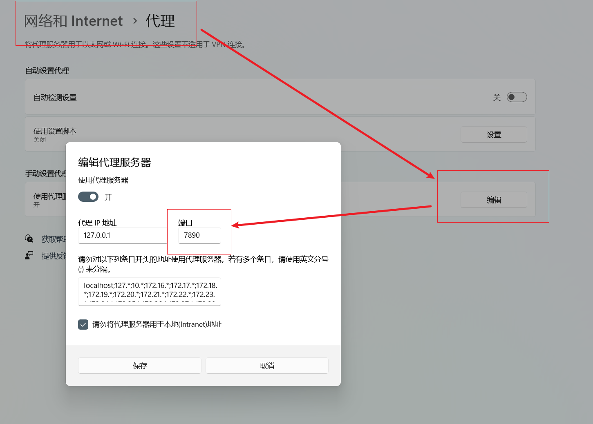

# 内容介绍

## [Kotlin](https://kotlinlang.org/)

> Kotlin is a cross-platform, statically typed, general-purpose programming language with type inference. Kotlin is designed to interoperate fully with Java, and the JVM version of Kotlin's standard library depends on the Java Class Library, but type inference allows its syntax to be more concise.

## [Develop Android apps with Kotlin](https://developer.android.com/kotlin) 

> Write better Android apps faster with Kotlin. Kotlin is a modern statically typed programming language used by over 60% of professional Android developers that helps boost productivity, developer satisfaction, and code safety.

## [Android Studio](https://developer.android.com/studio) 

> Android Studio provides the fastest tools for building apps on every type of Android device.

## [Machine learning for mobile developers](https://developers.google.com/ml-kit) 

> ML Kit brings Google’s machine learning expertise to mobile developers in a powerful and easy-to-use package. 

# 课程说明
## 课程成绩构成
- 平时成绩：40%（[上机实践](https://k.nkugame.com/#/?id=%e4%b8%8a%e6%9c%ba%e5%ae%9e%e8%b7%b5) + 课堂作业与考勤）
- 期末成绩：60%（[课程报告：基于Unity的App设计与开发](https://docs.qq.com/doc/DYkV4cUlObnlEcmdZ)）
> - Unity账号：[注册与登记](https://docs.qq.com/sheet/DYmVES0JZUlRoeWJC?tab=BB08J2)
> - Unity中文课堂：[Unity引擎基础课程](https://learn.u3d.cn/campus/course/unity-ling-hang-ji-hua/introduction)
> - 课程报告提交时间：2023年6月23日23:59:59之前
> - 课程报告提交方式：TBD


# 上机实践
## 准备工作
1. 注册 ***[腾讯工蜂](https://code.tencent.com/)*** 账号

2. 在 ***[花名册](https://docs.qq.com/sheet/DYkhuUXp6eE1neURh?tab=BB08J2)*** 中填入个人 ***手机号*** 和 ***腾讯工蜂用户名*** (腾讯工蜂：个人设置->账户->用户名)

3. 每次作业通过 ***[腾讯工蜂](https://code.tencent.com/)*** 上对应项目的 ***“议题(issues)”*** 进行提交
> - 每次作业提交的截止日期为下次上机的前一天
> - 议题的标题用 ***“学号+姓名”*** 命名（如 ***“2000000李逵”***）
> - 议题的撰写采用Markdown：语法请参考 ***[Markdown官方教程](https://markdown.com.cn/basic-syntax/)***

4. 每次作业（议题）需要包含的内容包括：
> - 关键代码截图（3-5张）：包含文件名和关键代码
> - App关键界面截图（3-5张）
> - 徽章Badge截图（1张）：包含个人头像和徽章

5. 每个单元和课程的学习路线（Pathway）需要代理才能访问，或者：
> - 将路径中的 `https://developer.android.com/`
> - 替换成 `https://developer.android.google.cn/` 
> - 即可不用代理就能访问

## 第1单元：[Kotlin 使用入门](https://developer.android.com/courses/android-development-with-kotlin/unit-1)
***Take your first steps programming in Kotlin.***

### 第1课：Kotlin 基础知识
> - 学习路线：[Pathway](https://developer.android.com/courses/pathways/android-development-with-kotlin-1)（需要代理）
> - 作业提交：[Issues](https://git.code.tencent.com/smd2023/Lesson1)
> - 开始日期：2023年2月27日
> - 截止日期：2023年3月5日 23:59:59

### 第2课：函数
> - 学习路线：[Pathway](https://developer.android.com/courses/pathways/android-development-with-kotlin-2)（需要代理）
> - 作业提交位置：[Issues](https://git.code.tencent.com/smd2023/Lesson2)
> - 开始日期：2023年3月6日
> - 截止日期：2023年3月12日 23:59:59

### 第3课：类和对象
> - 学习路线：[Pathway](https://developer.android.com/courses/pathways/android-development-with-kotlin-3)（需要代理）
> - 作业提交位置：[Issues](https://git.code.tencent.com/smd2023/Lesson3)
> - 开始日期：2023年3月13日
> - 截止日期：2023年3月19日 23:59:59

## 第2单元：[Android 简介](https://developer.android.com/courses/android-development-with-kotlin/unit-2)
***Get an introduction to Android development and UI basics.***

### 第4课：构建首个 Android 应用
> - 学习路线：[Pathway](https://developer.android.com/courses/pathways/android-development-with-kotlin-4)（需要代理）
> - 作业提交位置：[Issues](https://git.code.tencent.com/smd2023/Lesson4)
> - 开始日期：2023年3月20日
> - 截止日期：2023年3月26日 23:59:59

### 第5课：布局
> - 学习路线：[Pathway](https://developer.android.com/courses/pathways/android-development-with-kotlin-5)（需要代理）
> - 作业提交位置：[Issues](https://git.code.tencent.com/smd2023/Lesson5)
> - 开始日期：2023年3月27日
> - 截止日期：2023年4月2日 23:59:59

### 第6课：应用导航
> - 学习路线：[Pathway](https://developer.android.com/courses/pathways/android-development-with-kotlin-6)（需要代理）
> - 作业提交位置：[Issues](https://git.code.tencent.com/smd2023/Lesson6)
> - 开始日期：2023年4月3日
> - 截止日期：2023年4月9日 23:59:59

## 第3单元：[Android 应用架构](https://developer.android.com/courses/android-development-with-kotlin/unit-3)
***Learn Android app architecture using Kotlin.***

### 第7课：Activity 和 fragment 生命周期
> - 学习路线：[Pathway](https://developer.android.com/courses/pathways/android-development-with-kotlin-7)（需要代理）
> - 作业提交位置：[Issues](https://git.code.tencent.com/smd2023/Lesson7)
> - 开始日期：2023年4月10日
> - 截止日期：2023年4月16日 23:59:59

### 第8课：应用架构 (界面层)
> - 学习路线：[Pathway](https://developer.android.com/courses/pathways/android-development-with-kotlin-8)（需要代理）
> - 作业提交位置：[Issues](https://git.code.tencent.com/smd2023/Lesson8)
> - 开始日期：2023年4月17日
> - 截止日期：2023年4月23日 23:59:59

### 第9课：应用架构 (持久层)
> - 学习路线：[Pathway](https://developer.android.com/courses/pathways/android-development-with-kotlin-9)（需要代理）
> - 作业提交位置：[Issues](https://git.code.tencent.com/smd2023/Lesson9)
> - 开始日期：2023年4月24日
> - 截止日期：2023年4月30日 23:59:59

### 第10课：高级 RecyclerView 用例
> - 学习路线：[Pathway](https://developer.android.com/courses/pathways/android-development-with-kotlin-10)（需要代理）
> - 作业提交位置：[Issues](https://git.code.tencent.com/smd2023/Lesson10)
> - 开始日期：2023年5月8日
> - 截止日期：2023年5月14日 23:59:59

### 第11课：连接到互联网
> - 学习路线：[Pathway](https://developer.android.com/courses/pathways/android-development-with-kotlin-11)（需要代理）
> - 作业提交位置：[Issues](https://git.code.tencent.com/smd2023/Lesson11)
> - 开始日期：2023年5月15日
> - 截止日期：2023年5月21日 23:59:59

> 如果访问互联网资源失败，可以选择如下方法之一进行解决
- 方法一：请修改 app/java/network/MarsApiService.kt 文件中的 BASE_URL 值
    - 原始值："https://android-kotlin-fun-mars-server.appspot.com"
    - 修改为："https://openit-7gl1g0x9db6d6680-1305888744.ap-shanghai.app.tcloudbase.com"

- 方法二：使用宿主代理（以 Android Studio 创建的模拟器为例）
    - 如果你的主机能访问上述 BASE_URL，但是安卓模拟器不能访问，可以按如下方法操作
    - 查找 Android Studio -> Tools -> SDK Manager 中的 Android SDK 路径
    

    - 在 Android Studio 底部的 Terminal 窗口中输入命令：进入上述SDK路径下adb所在的子目录
    

    - 查看和连接模拟器设备，并设置代理([设置 Android 模拟器网络](https://developer.android.google.cn/studio/run/emulator-networking?hl=zh-cn))
    ```
    $ adb devices
    $ adb -s emulator-5554 shell
    $ settings put global http_proxy 10.0.2.2:port // port为pc的代理端口
    ```
    

    - Windows环境下，上述 port（pc的代理端口）可以通过如下方式查询到
    


### 第12课：仓库模式和 WorkManager
> - 学习路线：[Pathway](https://developer.android.com/courses/pathways/android-development-with-kotlin-12)（需要代理）
> - 作业提交位置：[Issues](https://git.code.tencent.com/smd2023/Lesson12)
> - 开始日期：2023年5月22日
> - 截止日期：2023年5月28日 23:59:59

## 第4单元：[Android 应用设计](https://developer.android.com/courses/android-development-with-kotlin/unit-4)
***Learn best practices, guidelines, and tools for effective Android app design.***

### 第13课：应用界面设计
> - 学习路线：[Pathway](https://developer.android.com/courses/pathways/android-development-with-kotlin-13)（需要代理）
> - 作业提交位置：[Issues](https://git.code.tencent.com/smd2023/Lesson13)
> - 开始日期：2023年5月29日
> - 截止日期：2023年6月4日 23:59:59